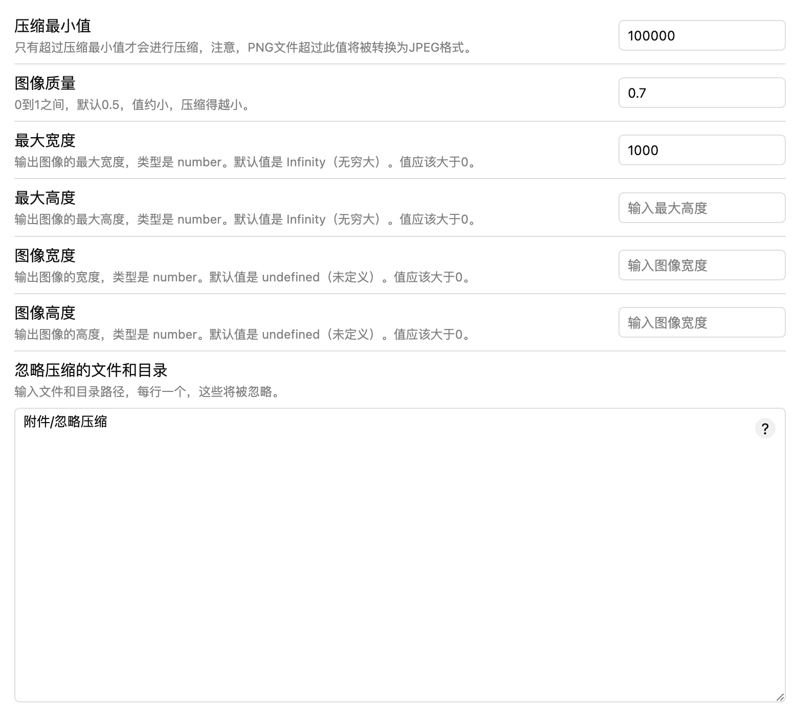

# Obsidian Image Compress

> [!tip]
> 解决 Obsidian 中每次上传大图的问题，通过这款图片压缩插件，你可以轻松地控制图片质量、最大宽高等参数。

## 更新记录

## 1.1.0

- 支持忽略压缩文件或目录，支持正则匹配
- fix bug：部分失败场景，重置当前压缩的图片

## 1.0.3

- 未避免多次压缩，增加压缩最小值，只要超过最小值才进行压缩

### 1.0.2

- 解决jpg压缩问题
- 解决设置为空时默认值的问题

### 1.0.1

- 完善提示功能

### 1.0.0

- 完成基本功能

## 安装

1. 下载最新的插件版本的压缩包文件（zip 格式）。
2. 在 Obsidian 中打开“设置”。
3. 转到“插件”部分。
4. 点击“安装插件”按钮，选择下载的压缩包文件。
5. 启用插件。

## 配置

在设置中，你可以动态配置插件的参数，包括图片质量、最大宽度、最大高度等。

## 使用

1. 在 Obsidian 编辑器中，上传或插入图片。
2. 图片将在上传或插入时被自动压缩，根据你的配置应用相应的参数。

## 注意事项

- 请根据需要调整配置参数，以获得最佳的压缩效果。

## 贡献

如果你发现问题或有改进建议，欢迎随时提 issue。

## 许可证

本插件采用 [MIT 许可证](LICENSE)。

